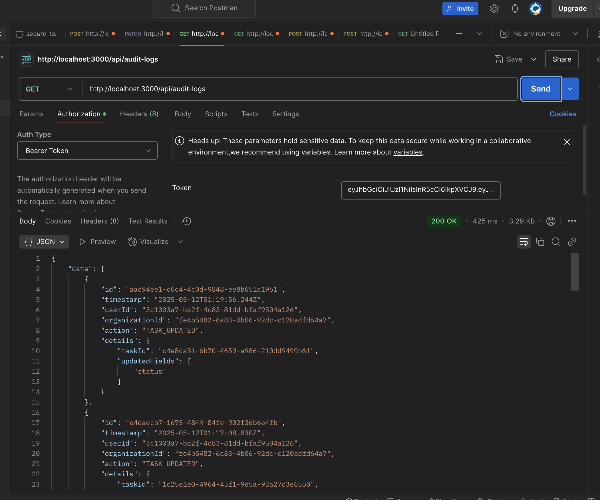

# Running the SecureTasksMono Application

This document provides instructions on how to set up and run the frontend and backend components of the `SecureTasksMono` project.

## Setup Instructions

1.  **Prerequisites:**
    *   Ensure you have [Node.js](https://nodejs.org/) installed (which includes npm).
    *   Ensure you have [pnpm](https://pnpm.io/installation) installed. You can install it via npm if you haven't already: `npm install -g pnpm`.
    *   Clone the repository to your local machine.
    *   Navigate into the project's root directory: `cd path/to/secure-tasks-mono`.

2.  **Install Dependencies:**
    *   In the root of the `secure-tasks-mono` directory, run the following command to install all necessary packages for the monorepo (frontend, backend, and shared libraries):
        ```bash
        pnpm install
        ```
3. **ENV File**
    * Refer to env.example.txt to set up your env file.

## How to Run Frontend and Backend

You will need to run both the frontend and backend applications simultaneously, each in its own terminal window or tab.

### 1. Running the Backend (API - NestJS)

*   Open a terminal window/tab.
*   Navigate to the root of the project directory:
    ```bash
    cd /path/to/secure-tasks-mono
    ```
*   Execute the command: To build all the libraries
    ```bash
    pnpm build:all
    ```
   
*   Execute the command: To run the backend application
    ```bash
    pnpm start:api
    ```
    Alternatively, you can use the Nx command directly:
    ```bash
    npx nx serve api
    ```
*   The NestJS backend server will start. Observe the terminal output for the port number it is running on (e.g., `http://localhost:3000` or `http://localhost:3333`).

### 2. Running the Frontend (Web Application - Angular)

*   Open a **new** terminal window/tab.
*   Navigate to the root of the project directory:
    ```bash
    cd /path/to/secure-tasks-mono
    ```
*   Navigate to /apps/web/src/app/environments
    Set up the backend port here
    ```typescript
    export const environment = {
        production: false,
        apiUrl: 'http://localhost:3000', // Your local backend API base URL
    };

    ```
*   Execute the command:
    ```bash
    pnpm start:web
    ```
    Alternatively, you can use the Nx command directly:
    ```bash
    npx nx serve web
    ```
*   The Angular frontend development server will start. Observe the terminal output for the port number it is running on (e.g., `http://localhost:4200`). You can then open this URL in your web browser.

## Important Notes

*   **Backend First:** The backend API should generally be running before you start or expect the frontend application to function correctly, as the frontend will make requests to the API for data. Make sure that the backend is built and ran.
*   **Database Migrations:** The `package.json` includes scripts for database migrations (e.g., `pnpm db:migration:run`). If you are setting up the project for the first time, or if there have been database schema changes, you might need to run these migrations. This typically requires the database server to be running and correctly configured in your environment variables (`.env` file).
*   **Environment Variables (`.env`):** Backend applications often rely on a `.env` file in the `apps/api` directory (or project root, depending on configuration) for settings like database connection strings, JWT secrets, etc. Ensure this file is present and correctly configured if needed.
*   **Production Builds:** The commands `pnpm build:api` and `pnpm build:web` (or `npx nx build api` and `npx nx build web`) are for creating optimized production builds of the applications and are not typically used for local development. 


## Architecture Overview

The architecture of `SecureTasksMono` is a monorepo managed by Nx, designed for scalability, maintainability, and code sharing. It comprises a backend API, a frontend web application, and several shared libraries.

### Core Components:

1.  **Nx Monorepo:**
    *   The entire project is housed within an Nx workspace. This approach facilitates:
        *   **Code Sharing:** Common logic, types, and configurations can be easily shared across different parts of the application (e.g., between frontend and backend, or among backend microservices/modules).
        *   **Consistency:** Enforces consistent build, test, and linting processes across all projects.
        *   **Modularity:** Encourages breaking down the application into smaller, manageable, and independent libraries and applications.
        *   **Optimized Tooling:** Leverages Nx's computation caching and affected commands for faster builds and tests.

2.  **Backend (`apps/api` - NestJS):**
    *   A robust and scalable backend built with the [NestJS](https://nestjs.com/) framework (Node.js).
    *   **Modular Design:** Organized into modules, each typically representing a domain or feature (e.g., authentication, users, tasks, organizations). This is reflected in the `libs/*-backend` structure.
    *   **Services:** Contain the core business logic for each module.
    *   **Controllers:** Expose RESTful API endpoints to handle incoming HTTP requests and interact with services.
    *   **Database Interaction:** Uses [TypeORM](https://typeorm.io/) as the Object-Relational Mapper (ORM) for interacting with a PostgreSQL database (as indicated by `pg` and `typeorm` dependencies and previous discussions). The database-specific code is largely encapsulated in the `libs/database` library.
    *   **Authentication & Authorization:** Implements JWT (JSON Web Token) based authentication (handled by `libs/auth` and `libs/security`) to secure API endpoints. Role-based access control is in place to manage permissions.

3. **Database:** For this, I am using Postgresql database using [Supabase](https://supabase.com/)
    


4.  **Frontend (`apps/web` - Angular):**
    *   A dynamic single-page application (SPA) built with the [Angular](https://angular.io/) framework.
    *   **Component-Based:** The UI is constructed from reusable and self-contained components.
    *   **Services:** Angular services are used for fetching data from the backend API, managing application state, and encapsulating other frontend logic.
    *   **Routing:** Angular's router manages navigation between different views/pages within the application.
    *   **State Management:** Utilizes [NgRx](https://ngrx.io/) for predictable and centralized state management, making it easier to manage complex application data flows.
    *   **Styling:** Primarily uses [TailwindCSS](https://tailwindcss.com/) for a utility-first approach to styling, allowing for rapid UI development.

5.  **Shared Libraries (`libs/`):**
    *   A crucial part of the monorepo, these libraries promote code reuse and separation of concerns. Key libraries include:
        *   `libs/data`: Contains shared data structures, DTOs (Data Transfer Objects), enums, and interfaces used by both the frontend and backend, ensuring consistency in data contracts.
        *   `libs/database`: Manages database entities, configurations for TypeORM, and migration scripts.
        *   `libs/auth`: Handles authentication logic, JWT strategies, and related utilities, primarily used by the backend.
        *   `libs/security`: Provides security-related utilities, potentially including guards and decorators.
        *   `libs/users-backend`, `libs/tasks-backend`, `libs/organizations-backend`, `libs/audit-log-backend`: These are domain-specific backend libraries that encapsulate the business logic, services, and potentially controllers/modules related to their respective domains. The main `apps/api` likely aggregates these.

### Communication Flow:

1.  **User Interaction:** The user interacts with the Angular frontend (`apps/web`) through their web browser.
2.  **Frontend to Backend:** The frontend makes HTTP requests (e.g., GET, POST, PUT, DELETE) to the NestJS backend API (`apps/api`) to fetch or modify data.
3.  **API Request Handling:** The NestJS backend receives requests, which are routed to the appropriate controllers.
4.  **Business Logic:** Controllers utilize services (often from the shared `libs/*-backend`) to perform business logic.
5.  **Data Persistence:** Services interact with the database (PostgreSQL) via TypeORM (configured in `libs/database`) to store and retrieve data.
6.  **API Response:** The backend sends responses (typically JSON) back to the frontend.
7.  **UI Update:** The frontend processes the responses and updates the UI accordingly, often managing state changes through NgRx.

This architecture aims for a clean separation of concerns, enabling independent development and scaling of different parts of the application while maximizing code reuse and consistency through the Nx monorepo structure.

## Data Model Explanation

The data model for `SecureTasksMono` is designed to manage users, their organizational affiliations, tasks, and audit trails. The core entities are defined primarily through Data Transfer Objects (DTOs) located in `libs/data/src/lib/dto` and associated enumerations in `libs/data/src/lib/enums`.

### Core Entities:

1.  **User (`UserDto`, `CreateUserDto`, `UpdateUserDto`):**
    *   Represents an individual user within the system.
    *   **Key Attributes:**
        *   `id` (UUID): Unique identifier for the user.
        *   `email` (string): User's email address, used for login.
        *   `name` (string, optional): User's display name.
        *   `password` (string, in `CreateUserDto`): User's password (expected to be hashed before storage). Not directly exposed in `UserDto`.
        *   `roleId` (number/UUID): Identifier linking to the user's `Role`.
        *   `organizationId` (UUID): Identifier linking the user to their primary `Organization`.
        *   `createdAt` (string/Date): Timestamp of user creation.
        *   `updatedAt` (string/Date): Timestamp of last user update.
    *   Note: `isActive` is mentioned as a potential field, managed internally or by an admin.

2.  **Organization (`OrganizationDto`, `CreateOrganizationDto`, `UpdateOrganizationDto`):**
    *   Represents an organizational unit or a team within the application. Tasks and users are typically scoped to an organization.
    *   **Key Attributes:**
        *   `id` (UUID): Unique identifier for the organization.
        *   `name` (string): Name of the organization.
        *   `parentOrganizationId` (UUID, optional): Identifier for a parent organization, allowing for hierarchical structures.
        *   `createdAt` (string/Date): Timestamp of organization creation.
        *   `updatedAt` (string/Date): Timestamp of last organization update.

3.  **Task (`TaskDto`, `CreateTaskDto`, `UpdateTaskDto`):**
    *   Represents a task or a to-do item.
    *   **Key Attributes:**
        *   `id` (UUID): Unique identifier for the task.
        *   `title` (string): The main title or name of the task.
        *   `description` (string, optional): Detailed description of the task.
        *   `status` (`TaskStatus` enum): Current status of the task (e.g., `PENDING`, `IN_PROGRESS`, `COMPLETED` - defined in `libs/data/src/lib/enums/task-status.enum.ts`).
        *   `category` (string, optional): A category for the task.
        *   `dueDate` (string, optional): Due date for the task.
        *   `creatorId` (UUID): Identifier of the user who created the task.
        *   `assigneeId` (UUID, optional): Identifier of the user to whom the task is assigned.
        *   `organizationId` (UUID): Identifier of the organization to which this task belongs.
        *   `tags` (string[], optional): An array of tags associated with the task.
        *   `createdAt` (string/Date): Timestamp of task creation.
        *   `updatedAt` (string/Date): Timestamp of last task update.

4.  **Role (`RoleDto`):**
    *   Defines the roles users can have within the system, which dictates their permissions.
    *   **Key Attributes:**
        *   `id` (string/number): Unique identifier for the role.
        *   `name` (string): Name of the role (e.g., `OWNER`, `ADMIN`, `MEMBER` - likely corresponding to `RoleType` enum from `libs/data/src/lib/enums/role-type.enum.ts`).
        *   `description` (string, optional): Description of the role.
        *   `createdAt` (Date): Timestamp of role creation.
        *   `updatedAt` (Date): Timestamp of last role update.
    *   Permissions associated with roles are hinted at (`PermissionDto`) but not fully detailed in the provided DTO.

5.  **Audit Log (`AuditLogResponseDto`, `FindAuditLogQueryDto`):**
    *   Records significant actions performed by users within the system for tracking and security purposes.
    *   **Key Attributes:**
        *   `id` (string): Unique identifier for the audit log entry.
        *   `timestamp` (Date): When the action occurred.
        *   `userId` (string, optional): The ID of the user who performed the action.
        *   `organizationId` (string): The ID of the organization context for the action.
        *   `action` (string): A description of the action performed (e.g., "TASK_CREATED", "USER_LOGIN").
        *   `details` (Record<string, any>, optional): Additional details about the action (e.g., the ID of the created task).

### Relationships (Implied):

*   A **User** belongs to one **Organization** and has one **Role**.
*   An **Organization** can have many **Users**.
*   An **Organization** can have many **Tasks**.
*   An **Organization** can have a parent **Organization** (hierarchical).
*   A **Task** is created by a **User** and can be assigned to another **User**.
*   A **Task** belongs to one **Organization**.
*   **AuditLog** entries are associated with a **User** (optional, for system actions) and an **Organization**.

This data model forms the backbone of the application, enabling structured storage and retrieval of information related to users, their work context, and their activities. The use of DTOs with validation decorators (`class-validator`) ensures data integrity at the API level.

### Entity Relationship Diagram

For a visual representation of the data model and entity relationships, please refer to the ER Diagram below:(ER Diagram is created in Supabase)


## Access Control Implementation

Access control in `SecureTasksMono` is implemented through a combination of JSON Web Tokens (JWT) for authentication, role-based authorization, and organization-scoped data access, primarily enforced at the backend API level.

### 1. Authentication:

*   **JWT (JSON Web Tokens):**
    *   Upon successful login (via `AuthService`), the API issues a JWT to the client.
    *   This token must be included in the `Authorization` header (as a Bearer token) for all subsequent requests to protected endpoints.
    *   The `JwtStrategy` (`libs/auth/src/lib/strategies/jwt.strategy.ts`) is responsible for validating the token's signature and expiration.
    *   **JWT Payload:** A validated JWT decodes to a payload containing crucial user identifiers:
        *   `sub`: The user's unique ID (`userId`).
        *   `email`: The user's email.
        *   `roleId`: The ID of the user's assigned role.
        *   `organizationId`: The ID of the organization the user belongs to and is currently operating within.
    *   This payload is attached to the `request.user` object in NestJS controllers, making user context readily available.

### 2. Authorization:

*   **Roles:**
    *   The system defines several user roles (e.g., `OWNER`, `ADMIN`, `MEMBER`/`VIEWER`), as defined in `libs/data/src/lib/enums/role-type.enum.ts`. Each `User` entity is associated with a `roleId`.
*   **Guards:** NestJS guards are used extensively to protect API endpoints.
    *   **Authentication Guard (Implicit `AuthGuard('jwt')`):** Most API routes are protected by a default JWT authentication guard, ensuring that only requests with a valid JWT can access them. This is typically applied globally or on a per-controller/per-route basis.
    *   **Permissions Guard (`PermissionsGuard`):**
        *   Located in `libs/auth/src/lib/guards/permissions.guard.ts`.
        *   This guard provides fine-grained access control. It works in conjunction with a custom decorator (likely `@RequirePermissions(...)` defined via `PERMISSIONS_KEY`) applied to controller methods or entire controllers.
        *   It retrieves the `roleId` from `request.user`.
        *   It calls `AuthService.getPermissionsForRole(roleId)` to fetch the actual permissions associated with the user's role.
        *   It then checks if the user's actual permissions satisfy all the `requiredPermissions` specified by the decorator for the given endpoint.
        *   If permissions are insufficient, a `ForbiddenException` is thrown.
*   **Role-Specific Logic:**
    *   **Owner Role:** Users with the "Owner" role (`roleId: 1`) have special privileges, including the ability to access and manage resources across all organizations. Backend services and controllers incorporate logic to bypass organization-scoping for Owners where appropriate (e.g., viewing or updating tasks regardless of the `organizationId` in their JWT if the business rule allows it).
    *   **Admin Role:** Users with the "Admin" role are typically scoped to their `organizationId` (from the JWT). They can manage resources (users, tasks) only within their own organization.
    *   **Other Roles (e.g., Member/Viewer):** These roles generally have more restricted permissions, typically read-only or limited write access, also scoped to their `organizationId`.

### 3. Data Scoping:

*   **Organization-Scoped Access:**
    *   For most users (non-Owners), data access is strictly scoped by the `organizationId` present in their JWT.
    *   Backend services ensure that database queries and operations are filtered by this `organizationId` to prevent users from accessing or modifying data belonging to other organizations.
    *   For example, when a user requests their tasks, the query will include a condition like `WHERE organizationId = :userOrganizationId`.
*   **Cross-Organization Access for Owners:** As mentioned, specific logic exists to allow "Owner" role users to operate across organization boundaries when necessary, overriding the default JWT `organizationId` scoping for those particular operations.

### Summary of Enforcement:

1.  Client sends a request with JWT.
2.  NestJS `AuthGuard` (via `JwtStrategy`) validates the JWT. If invalid, 401 Unauthorized.
3.  If valid, `request.user` is populated with JWT payload.
4.  `PermissionsGuard` (if applied to the route) checks if `request.user.roleId` has the required permissions for the action. If not, 403 Forbidden.
5.  Controller logic and service methods use `request.user.organizationId` (and `request.user.roleId` for Owner checks) to scope data access and enforce business rules.

This multi-layered approach ensures that authentication is robust, authorization is granular and role-based, and data is appropriately isolated between different organizations while allowing for necessary administrative overrides by privileged roles.

## API Docs

The API for `SecureTasksMono` is implemented using NestJS. While an automated API documentation tool like Swagger/OpenAPI is not currently integrated into the project, the API structure follows RESTful principles and can be understood by examining the controllers and DTOs.

### Key Information for Understanding the API:

1.  **Base Path:**
    *   All API endpoints are prefixed with `/api`. For example, if a controller defines a route `/tasks`, the full path would be `http://localhost:3000/api/tasks` (assuming the API is running on the default port 3000).

2.  **Authentication:**
    *   Most endpoints require JWT authentication. A valid JWT must be sent in the `Authorization` header as a Bearer token.
    *   Login endpoints (e.g., `/api/auth/login`) will not require this header and will return a JWT upon successful authentication.

3.  **Data Transfer Objects (DTOs):**
    *   Request and response payloads are structured according to DTOs defined in the `libs/data/src/lib/dto` directory. These DTOs specify the expected shape of the data and include validation rules (using `class-validator`). Refer to these files for details on request body parameters and response structures.

4.  **Controllers:**
    *   API endpoints are defined in controller files, typically located within module-specific backend libraries (e.g., `libs/tasks-backend/src/lib/tasks.controller.ts`, `libs/users-backend/src/lib/users.controller.ts`, etc.) or directly within `apps/api/src/app/modules/`.
    *   Standard HTTP methods are used:
        *   `GET`: To retrieve resources.
        *   `POST`: To create new resources.
        *   `PUT` / `PATCH`: To update existing resources.
        *   `DELETE`: To remove resources.

5.  **Error Handling:**
    *   The API uses standard HTTP status codes to indicate success or failure.
        *   `200 OK`, `201 Created`, `204 No Content`: Successful operations.
        *   `400 Bad Request`: Client-side error (e.g., validation failure due to incorrect payload).
        *   `401 Unauthorized`: Missing or invalid JWT.
        *   `403 Forbidden`: Valid JWT but insufficient permissions for the requested operation.
        *   `404 Not Found`: Resource not found.
        *   `500 Internal Server Error`: Server-side error.

### Recommendations for API Exploration:

*   **Examine Controller Files:** The most direct way to understand the available endpoints, their paths, expected request methods, and parameters is to review the NestJS controller files within the `apps/api` and `libs/*-backend` directories.
*   **Review DTOs:** Understanding the DTOs in `libs/data` is crucial for knowing how to structure request payloads and what to expect in responses.
*   **Use an API Client:** Tools like Postman or Insomnia can be used to manually send requests to the API endpoints during development and explore their behavior.

### Key API Endpoints:

Below is a summary of the core API endpoints implemented in the application. All paths are prefixed with `/api`. Most endpoints require JWT authentication unless specified otherwise.

**General:**
*   `GET /health`: Health check for the API. (Public)

**Authentication (`/auth`):**
*   `POST /login`: User login with email and password. Returns a JWT. (Public). This JWT is being stored in the localstorage as of now. In future, it will be stored in cookies to improve security.
*   `POST /switch-role`: Allows an authenticated user to switch their role (e.g., if they belong to multiple roles or organizations with different roles). Requires JWT. Returns a new JWT.

**Users (`/users`):**
*   `POST /`: Register a new user. Returns the created user object and a JWT. (Public). This is used to sign up the user by sending JSON object.
 ```json
  {
    "email":"email@example.com",
    "password":"password",
    "name":"name",
    "roleId": 3, // 1 for OWNER, 2 for ADMIN, 3 for VIEWER
    "organizationId":"fe4b5482-6a83-4b06-92dc-c120adfd64a7" //Hardcoded - will be improved in future scope
    }
```


*   `GET /`: Retrieves a list of users.
    *   Can be filtered by `organizationId` (query parameter).
    *   Requires JWT and `PERM_USER_READ` permission for fetching all users or users from a specific organization.
*   `GET /:id`: Retrieves a specific user by their ID. Requires JWT.
*   `PATCH /:id`: Updates a specific user by their ID. Requires JWT.
*   `DELETE /:id`: Deletes a specific user by their ID. Requires JWT.

**Tasks (`/tasks`):** (All require JWT)
*   `POST /`: Creates a new task. Requires `PERM_TASK_CREATE` permission. Task is created within the user's `organizationId` from JWT.
*   `GET /`: Retrieves tasks for the user's current organization. Supports `assigneeId` and `searchTerm` query parameters.

*   `GET /all-organizations`: Retrieves tasks across all organizations. Requires `PERM_TASK_VIEW_ALL_ORGS` permission. Supports `searchTerm` query parameter.
*   `GET /:id`: Retrieves a specific task by its ID, scoped to the user's organization.
*   `PATCH /:id`: Updates a specific task by its ID. Requires `PERM_TASK_UPDATE` permission. Scoped to the user's organization.
*   `DELETE /:id`: Deletes a specific task by its ID. Requires `PERM_TASK_DELETE` permission. Scoped to the user's organization.

**Organizations (`/organizations`):** (All require JWT)
*   `POST /`: Creates a new organization.
*   `GET /`: Retrieves a list of all organizations.
*   `GET /:id`: Retrieves a specific organization by its ID.
*   `PATCH /:id`: Updates a specific organization by its ID.
*   `DELETE /:id`: Deletes a specific organization by its ID.

**Audit Logs (`/audit-logs`):** (All require JWT)
*   `GET /`: Retrieves audit logs for the user's organization. Supports pagination and filtering. Requires `PERM_AUDIT_READ` permission.

*Note: Specific permissions like `PERM_TASK_CREATE`, `PERM_USER_READ`, etc., are checked by the `PermissionsGuard` for authorized actions.*

## Future Considerations

*   **Integrate SignUp Screen** Right now there is no sign up option for the user. The user is being created using POST `/api/users`(due to time constraints)

*   **Securing Access Token in Cookies** Currently accessToken is being stored in localstorage which is unsecure. It will be stored in cookies for more security.
  
*   **Integrate Audit Log Screen** Right now audit logs are standalone apis which can be tested using Postman. Screen will be built in futurescope. 

*   **Integrate Swagger/OpenAPI:** For robust and interactive API documentation, consider integrating `@nestjs/swagger`. This package can automatically generate an OpenAPI specification and a user-friendly Swagger UI based on your controllers, DTOs, and decorators. This would provide a live, explorable documentation interface for developers.

*   **Enhanced and Scalable Permission Checks:**
    *   **More Granular Permissions:** As the application grows, introduce more specific permissions beyond basic CRUD operations for each entity (e.g., `PERM_TASK_ASSIGN_ANY`, `PERM_TASK_CHANGE_PRIORITY`, `PERM_USER_INVITE_TO_ORGANIZATION`). This allows for finer-grained control over user actions.
    *   **Policy Management UI:** For administrators (especially Owners), develop a user interface to manage roles and the permissions assigned to them. This would replace manual database entries or hardcoded permission sets, making the system more maintainable and transparent.
    *   **Permission Caching:** To improve performance, especially if `AuthService.getPermissionsForRole()` involves database queries, implement a caching mechanism for resolved user permissions. Cache invalidation strategies would be needed when roles or permissions are updated.

## Application Screen Shots


